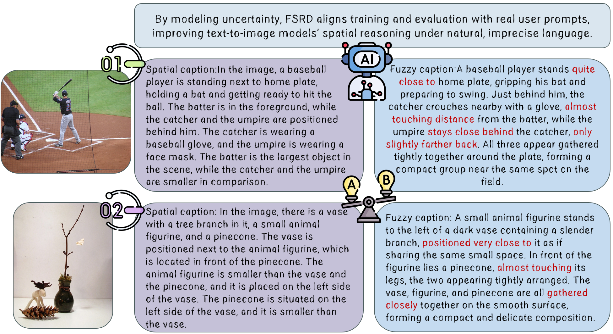

# Learning from Ambiguity: A Fuzzy Spatial Relationship Dataset for Human-Aligned Text-to-Image Generation

  
[] 

[Tianjiao Liang, Qinlong Li, Honggang Qi]

---

## 🤔 The Problem: The Gap in Spatial Understanding

Recent Text-to-Image (T2I) diffusion models excel at visual fidelity but consistently **struggle with interpreting fuzzy spatial language**—terms like *"somewhere to the right,"* *"roughly above,"* or *"fairly close."*

This failure stems from a fundamental data imbalance: standard training datasets (e.g., COCO) predominantly feature **precise, crisp spatial descriptions**, neglecting the graded and context-dependent nature of how humans actually describe object layouts. FSRD is designed to explicitly bridge this critical divide.

****

---

## 📜 Abstract

> **Abstract:** Recent text-to-image (T2I) diffusion models achieve impressive visual fidelity but consistently struggle with interpreting and generating images from natural language prompts containing fuzzy spatial relationships (e.g., "somewhere to the right," "fairly close"). This gap arises because standard training datasets predominantly feature precise spatial descriptions, neglecting the graded, context-dependent nature of human spatial language. To address this, we introduce the **Fuzzy Spatial Relationship Dataset (FSRD)**, a large-scale vision-language corpus designed to bridge this divide. FSRD comprises approximately eight million images from five public sources, each paired with synthetically generated captions that replace crisp spatial predicates with calibrated vague expressions. We detail an automated pipeline for constructing these captions, which involves a high-recall multi-detector ensemble for object localisation and a two-stage captioning process using vision-language models to generate globally coherent and pairwise fuzzy spatial descriptions. By explicitly modelling spatial vagueness, FSRD advances T2I generation towards more robust and human-aligned spatial understanding.

---

## 🔥 Highlights

- **📚 Large-Scale & Diverse:** Approximately **8 million images** sourced from COCO, CC12M, SA-1B, and other public datasets, re-captioned with rich fuzzy spatial semantics.
- **🧠 Automated Pipeline:** A robust, fully automated two-stage framework combining powerful ensemble detection and advanced VLM-based fuzzy caption generation.
- **💡 Human Alignment:** Explicitly models the **graded, context-dependent nature** of human spatial language for better T2I generation fidelity.
- **🚀 Enhanced Performance:** Fine-tuning on FSRD consistently and substantially improves a state-of-the-art model’s ability to faithfully render instructions like *"roughly above"* or *"very close to."*

---

## 🏗️ The Automated Construction Pipeline

Our pipeline ensures high-quality data generation at scale by combining high-recall detection with controlled, fluent captioning.

****

### Pipeline Details

Our two-stage process leverages the strengths of recent foundation models:

1.  **Object Localisation Ensemble:** We employ a high-recall ensemble of detectors (including models like **Grounding DINO** and **OWL-ViT**) to ensure robust and accurate bounding boxes for relevant objects within the scene.
2.  **Two-Stage Fuzzy Captioning:**
    * **Global Coherence:** A Vision-Language Model is initially used to generate a fluent, globally coherent description of the scene.
    * **Pairwise Fuzzification:** Crisp spatial predicates (e.g., "to the left," "above") are identified and systematically replaced with **calibrated vague expressions** (e.g., "towards the left side," "roughly above") based on geometric verification and a learned vagueness scale.

---

## 📂 Dataset Structure and Examples

The FSRD dataset provides images paired with both a global, fluent fuzzy caption and a structured list of pairwise fuzzy relations, enabling flexible usage for various T2I fine-tuning methods.

### Data Format

Each entry in FSRD contains the following key fields:

| Field Name | Description | Example Content |
| :--- | :--- | :--- |
| `image_id` | Unique identifier for the image. | `cc_0000001` |
| `global_caption_fuzzy` | The complete, human-aligned caption containing fuzzy terms. | A cat is **somewhere close to** a table with a laptop **roughly on top of** it. |
| `pairwise_relations` | A list of structured subject-predicate-object tuples. | `[('cat', 'somewhere close to', 'table'), ('laptop', 'roughly on top of', 'table')]` |
| `source_dataset` | The original source of the image (e.g., COCO, SA-1B). | `COCO` |

****

---
