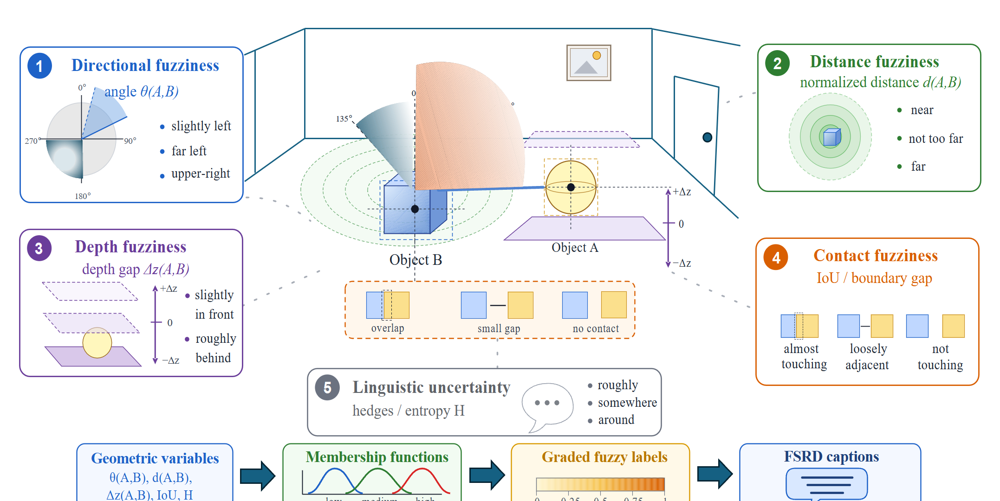
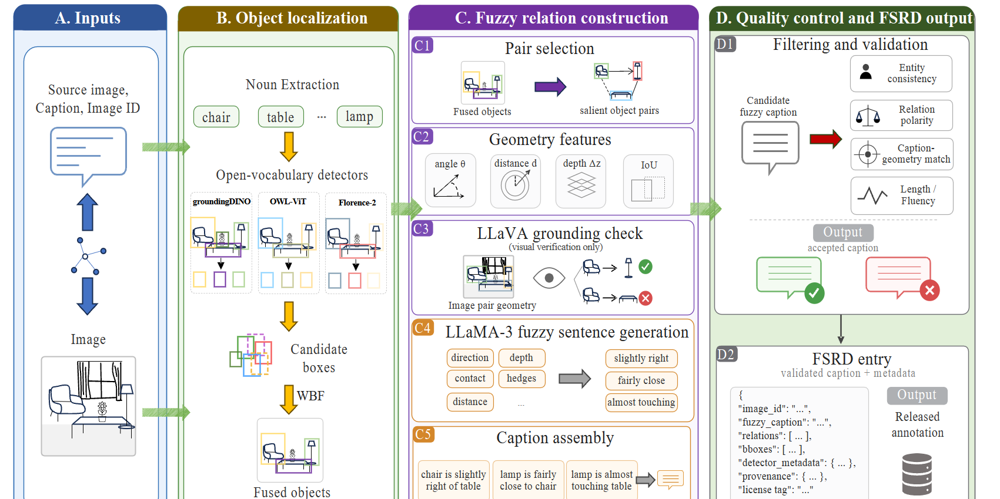
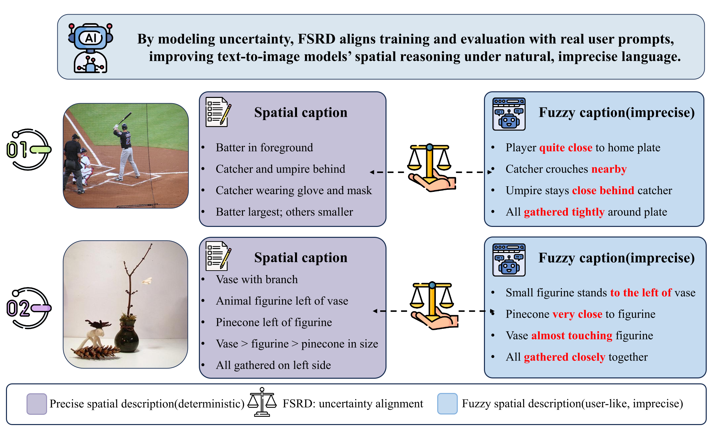
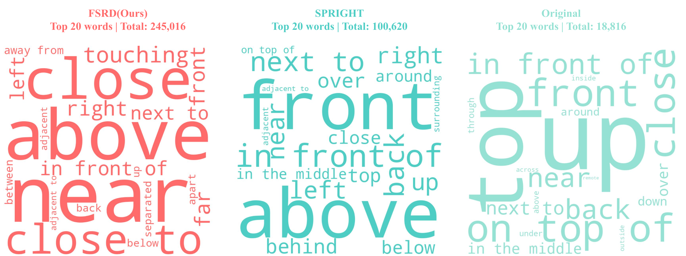

# Learning from Ambiguity: A Fuzzy Spatial Relationship Dataset for Human-Aligned Text-to-Image Generation

Official code and dataset repository for **"Learning from Ambiguity: A Fuzzy Spatial Relationship Dataset for Human-Aligned Text-to-Image Generation"**, submitted to *The Visual Computer*.

**Tianjiao Liang, Qinlong Li, Honggang Qi**

---

## 📢 Dataset Release Status

The FSRD dataset is currently being released progressively on Hugging Face.

Due to the large scale of the dataset, image-caption files, metadata files, and annotation shards will be uploaded in batches. The current repository may therefore contain only part of the full dataset during the release process. Please check the Hugging Face dataset page regularly for the latest available files and updates.

---

## 🤔 The Problem: The Gap in Spatial Understanding

Recent Text-to-Image (T2I) diffusion models excel at visual fidelity but consistently **struggle with interpreting fuzzy spatial language** — expressions such as *"roughly above,"* *"quite close,"* or *"almost touching."*

This limitation stems from a mismatch between how humans naturally describe scenes and how existing training datasets are annotated. Standard image-caption corpora tend to emphasize **precise, deterministic spatial descriptions**, whereas human language is often graded, context-dependent, and inherently vague.

To bridge this gap, we introduce the **Fuzzy Spatial Relationship Dataset (FSRD)**, a large-scale vision-language dataset explicitly designed to model fuzzy spatial language for more human-aligned T2I generation.

---

## 📜 Abstract

> Text-to-image diffusion models have achieved impressive visual fidelity, yet they often fail to follow spatial instructions expressed in natural human language. A key reason is that existing image-text corpora and spatial benchmarks mostly encode crisp predicates, such as left of'' or behind,'' whereas users frequently describe layouts with graded and context-dependent expressions, such as slightly to the right,'' fairly close,'' or ``almost touching.'' We introduce FSRD, a large-scale fuzzy spatial relationship dataset designed to improve spatially aligned and human-aligned text-to-image generation. FSRD contains approximately eight million images from five public sources, paired with fuzzy spatial captions and structured relation metadata generated through a multi-detector object-localization pipeline and a two-stage vision-language captioning process. We further propose a Spatial Fuzziness Metric, which combines geometric verification with semantic judgment to evaluate whether generated images satisfy vague spatial instructions under graded tolerance. Fine-tuning Stable Diffusion 2.1 (SD 2.1) with FSRD substantially improves spatial reasoning, achieving 68.0% VISOR accuracy on $SR\textsuperscript{2}D$ and consistent gains on T2I-CompBench, T2I-CompBench++, and a dedicated fuzzy-prompt benchmark. Human evaluation further confirms that fuzzy spatial supervision improves alignment with natural spatial descriptions. The dataset, code, evaluation prompts, and trained checkpoints are publicly available at https://github.com/NIEYEH/FSRD and https://huggingface.co/datasets/NIEYEHH/Fuzzy_Spatial_Relationship_Dataset.

---

## 🔥 Highlights

- **📚 Large-Scale & Diverse:** Approximately **8 million images** sourced from COCO, CC12M, SA-1B, and other public datasets, re-captioned with rich fuzzy spatial semantics.
- **🧠 Automated Pipeline:** A robust, fully automated framework combining ensemble object localization, geometry-aware fuzzy relation construction, and quality-controlled caption generation.
- **💡 Human Alignment:** Explicitly models the **graded and context-dependent nature** of human spatial language for better T2I generation fidelity.
- **🚀 Enhanced Performance:** Fine-tuning on FSRD improves a state-of-the-art model’s ability to follow imprecise, user-like spatial instructions.

---

## 📊 Word Distribution Comparison

To better illustrate the linguistic characteristics of FSRD, we compare the most frequent spatial words in **FSRD**, **SPRIGHT**, and **original captions**.  
FSRD contains substantially richer and more diverse fuzzy spatial expressions, reflecting its emphasis on human-like, imprecise spatial language.

---

## 🧭 Modeling Fuzzy Spatial Relationships

FSRD explicitly models multiple complementary sources of spatial uncertainty, including:

- **Directional fuzziness**
- **Distance fuzziness**
- **Depth fuzziness**
- **Contact fuzziness**
- **Linguistic uncertainty**

These geometric and linguistic variables are transformed through membership functions into graded fuzzy labels, which are then used to generate human-aligned fuzzy captions.

---

## 🏗️ The Automated Construction Pipeline

Our pipeline ensures high-quality data generation at scale by combining high-recall object localization with controlled and fluent fuzzy caption generation.

The full construction process includes:

1. **Inputs**  
   Source image, source caption, and image identifier.

2. **Object Localization**  
   Noun extraction followed by open-vocabulary detection using models such as **Grounding DINO**, **OWL-ViT**, and **Florence-2**. Candidate boxes are fused with weighted box fusion.

3. **Fuzzy Relation Construction**  
   - salient object-pair selection  
   - geometry feature extraction  
   - visual grounding verification  
   - fuzzy sentence generation with LLMs  
   - caption assembly

4. **Quality Control and FSRD Output**  
   Candidate captions are filtered and validated according to entity consistency, relation polarity, caption-geometry alignment, and fluency, producing the final released FSRD annotation.

---

## 🖼️ Example Caption Transformations

The figure below shows how FSRD transforms **precise spatial descriptions** into more **natural, user-like fuzzy captions**.

Compared with deterministic captions such as *"left of"* or *"behind"*, FSRD introduces graded and human-aligned expressions such as:

- *"quite close"*
- *"nearby"*
- *"close behind"*
- *"almost touching"*
- *"gathered closely together"*

This design better reflects how real users describe spatial layouts in everyday prompts.

---

## 📂 Dataset Structure

Each entry in FSRD contains the following key fields:

| Field Name | Description | Example Content |
| :--- | :--- | :--- |
| `image_id` | Unique identifier for the image. | `cc_0000001` |
| `global_caption_fuzzy` | A complete human-aligned caption containing fuzzy spatial expressions. | A cat is **quite close to** a table with a laptop **roughly on top of** it. |
| `pairwise_relations` | A list of structured subject-predicate-object tuples. | `[("cat", "quite close to", "table"), ("laptop", "roughly on top of", "table")]` |
| `source_dataset` | The original source of the image. | `COCO` |

---

## 📄 License

This dataset is released under the **CC BY-NC-SA 4.0** license.  
It is intended for non-commercial research and academic use.

Users should also comply with the licenses and terms of use of the original source datasets.
